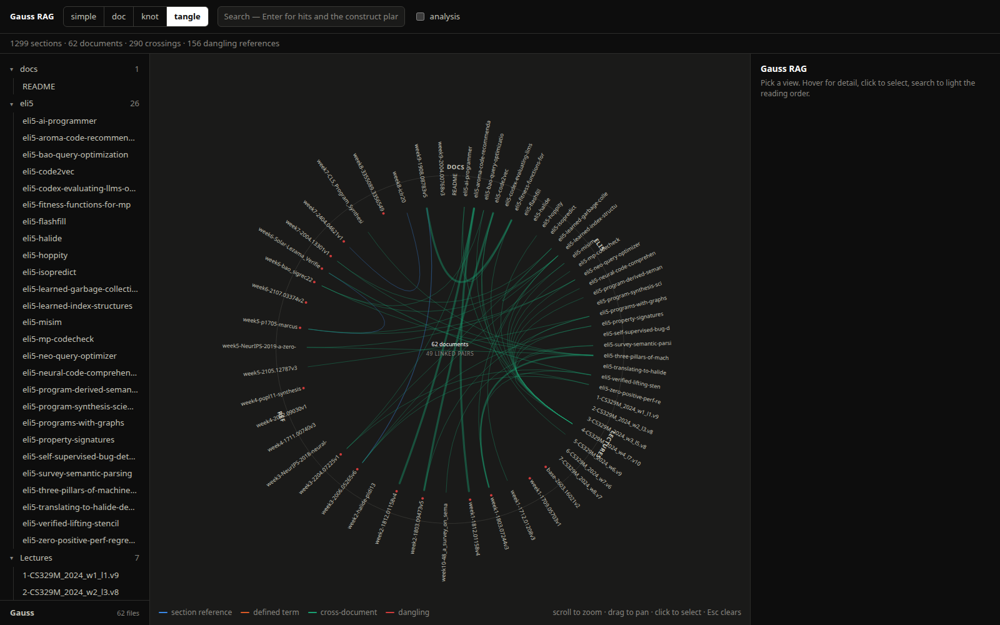
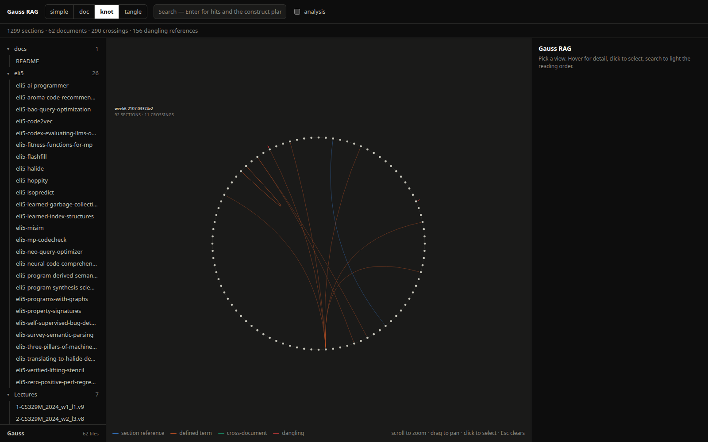
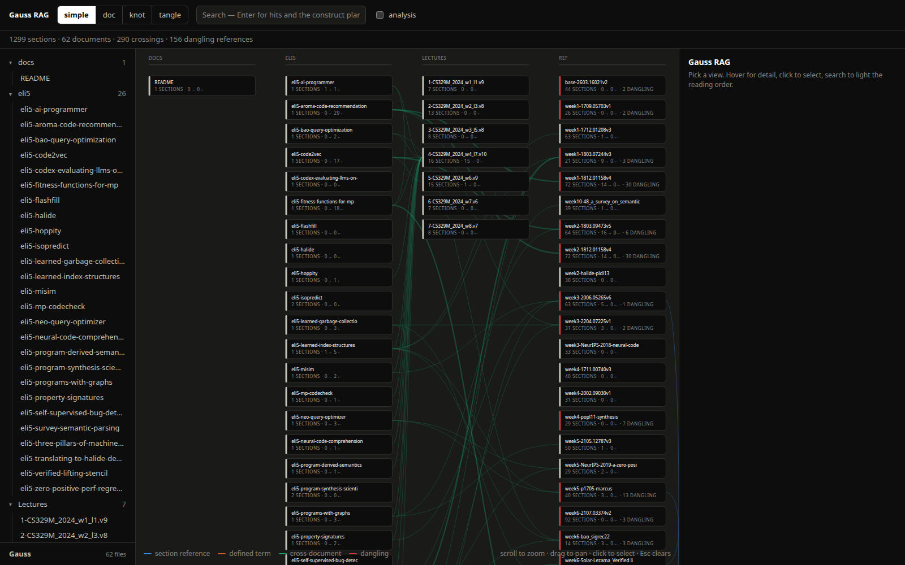

# Gauss RAG

**Documents as knots.** A Claude Code skill that turns a folder of documents into a retrieval system
you can search *and see*, built on one idea: a document is not a bag of chunks, it is a closed loop
that crosses itself.



## What Gauss does

Ordinary RAG chops a document into chunks, embeds them, and returns whichever chunks look most like
your question. It works, and it has a blind spot: it answers the part of the question that
pattern-matched and drops the thread. Ask a follow-up and it starts over. It never knew that
section 3.2 said *"subject to Section 27,"* because section 27 doesn't look like section 3.2.

Gauss RAG keeps the thread. It reads a document the way the document reads itself:

1. **Header to header.** Each section becomes one chunk, named by its place in the table of contents
   (`Contract › Article 5 › 5.2 Cure Period`). The heading path *is* the TOC.
2. **Closed into a ring.** The sections sit in reading order on a loop, last wrapping to first, so
   retrieval never falls off the end of a 300-page document.
3. **Cross-references as crossings.** Every *"see Section 27"*, every defined term used far from its
   definition, every mention of another document is a **crossing** where the loop passes over itself.
   In knot theory this is exactly what **Gauss code** writes down: walk the loop and record each
   crossing, `+` where you pass over (the reference), `−` where you pass under (what it refers to).
   A contract is a lexical knot; Gauss code is its notation.
4. **Several documents make a link.** Drop a source and your notes on it into the same folder and
   they knot together: a reference in one resolves into the other, and the reading order continues
   across the boundary. That is the study model most people actually use — one real reference on
   deck and notes from everywhere else — made literal.

Search then returns more than hits. Each hit carries a **construct plan**: the section, then what it
references, then what cites it, then its neighbours, in dependency order. Hand that to a model and the
answer is assembled the way the author connected it, so the *"oh, what about…"* is already in the
order before you ask.

### Four things this makes possible

- **See a document.** A flat page becomes a topology. The **knot** view is one document as a ring
  with its crossings as chords; the **tangle** view is every document at once, references bundled
  between them; **simple** is the at-a-glance boxes-and-arrows; **doc** is the readable section list.
- **Catch what's broken.** A reference to a section that doesn't exist is a **dangling** crossing, and
  Gauss surfaces it in red rather than hiding it. In a contract that is a drafting hole; in a spec it
  is a requirement pointing at nothing.
- **Find the load-bearing parts.** The **analysis** lens marks hubs (what everything depends on),
  fan-out (branchy sections referenced directly in prose — the requirements that will grow arms),
  and cycles (contention: A conditions B conditions A).
- **Do it to code.** Drop in an architecture map and typed edges (publishes, handles, owns, consumes,
  exposes) become crossings. A search on a job returns its execution trace: the job, the event it
  publishes, the module that handles it. The loops of a program, read the same way as the loops of
  a contract.



## Honest note on what it is and isn't

Measured against plain semantic+lexical retrieval, the knot is **not** a better retriever in general.
On broad questions, similarity plus a wide top-k already finds the related sections. Where it wins
outright is narrow and real: when the answer is semantically far from the question but explicitly
cross-referenced — *"what happens if I break the rules"* lands on the rules, and only the crossing
pulls up the penalty clause that was buried at rank eight. Its durable value is **ordering** and
**visibility**: a coherent reading order for assembling an answer, and a picture of the structure.

## Install (Claude Code, like any marketplace plugin)

```
/plugin marketplace add sireggserroneous/gauss-rag
/plugin install gauss-rag@gauss-rag
```

Then in any project, ask Claude to *"gauss rag this folder"*, or run it yourself:

```
python3 <skill-dir>/scaffold.py                       # creates ./Gauss/{docs,store,app.py,gauss.toml}
pip install weaviate-client                          # or: uv pip install -r <skill-dir>/skills/gauss-rag/requirements.txt
# drop .md / .txt / .pdf / code into Gauss/docs/
python3 Gauss/app.py                                 # -> http://127.0.0.1:8787
```

Needs Python 3.11+, `weaviate-client`, and poppler (`pdftotext`) for PDFs.

## Low budget by default

The knot, keyword search, and every view are built with **zero API calls**. Parsing is the cheapest
tier that works — direct read for text and code, `pdftotext` for PDFs with a text layer — and search
is BM25 through **embedded Weaviate**, which runs in-process from `Gauss/store/` with no server to
stand up. Crossings are stored as Weaviate **cross-references** between chunk objects; a knot is
literally objects with typed refs.

Two upgrades are opt-in in `gauss.toml`, because each costs a model call: `[embed]` adds semantic
vectors (one call per chunk) and turns search hybrid; `[ocr]` reads scanned PDFs through a vision
model (one call per page). Until you flip them, a scanned PDF is simply listed as `needs_ocr`.



## The app

`Gauss/app.py` serves a zero-dependency page: an Obsidian-style explorer on the left, the active view
in the middle, detail on the right. Hover anything for its label, click to select and dim the rest,
scroll to zoom, drag to pan, search to light the construct path across whichever view is open.
Adding a view is one render function. Endpoints for other tools:

`/search?q=…&construct=1` · `/knot.json` · `/doc?idx=N` · `/analyze` · `/reingest`

## Example

[`examples/machine-programming/`](examples/machine-programming/) is the first real corpus this ran
on: a machine-programming reading course — 28 papers, 7 lectures, and 26 plain-language ELI5
explainers. The explainers are included in full; the papers are linked. It is worth reading on its
own, and it shows the knots-of-knots effect: the notes became the most-cited hubs because the papers
name the systems they explain.

## Credits

Built from a year-old chunking experiment by Pedro Paulino: header-to-header beat sentences and
paragraphs; overlapping beat disjoint; closing the sequence into a ring beat everything. Gauss code
was the missing notation for the one thing the ring couldn't see. IBM's table-of-contents-guided
retrieval is the same insight from the other direction.

MIT — Pedro Paulino (Sir Eggs Erroneous).
